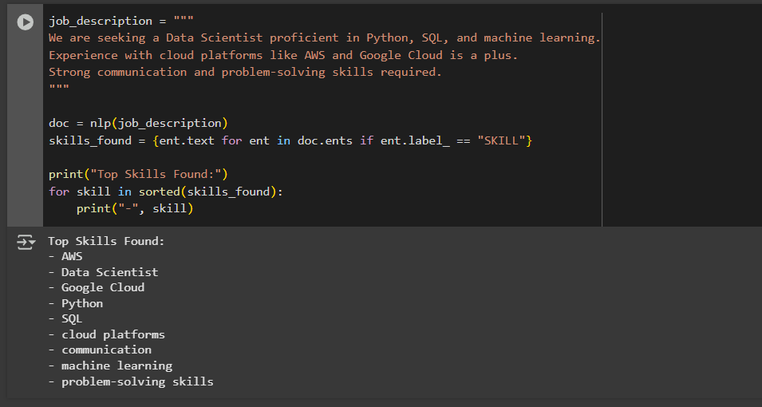

# AI-Skills-Extractor-From-Job-Description

# 🧠 AI Skills Extractor From Job Description

A simple yet powerful tool that uses **Natural Language Processing (NLP)** to automatically detect skills mentioned in any job description.  
This can help job seekers tailor their CVs to match exactly what hiring managers are looking for.

---

## 📌 Features
- **Extract Skills Automatically**: Identify technical and soft skills from any text.
- **Beginner-Friendly**: Easy to set up and run.
- **Based on spaCy NLP**: Uses pre-trained models for skill recognition.
- **Customizable**: Change the skill detection model or extend the skills list.

---

## 📷 Demo

**Example Job Description Input:**


**Extracted Skills Output:**


---

## 🚀 How to Use

### 1️⃣ Clone the Repository
```bash
git clone https://github.com/Dejigner/AI-Skills-Extractor-From-Job-Description.git
cd AI-Skills-Extractor-From-Job-Description
```

### 2️⃣ Install Requirements
```bash
pip install -r requirements.txt
```

###3️⃣ Run the Script
```bash
python skills_extractor.py
```

🛠 Tech Stack
Python 3.8+
spaCy
NLP Skill Extraction Model

📄 Example Output
Top Skills Found:
- AWS
- Google Cloud
- Machine Learning
- Python
- SQL
  
📬 Contact
Created by Jannah Ahmed
LinkedIn: https://www.linkedin.com/in/jannah-abdelmawla/
